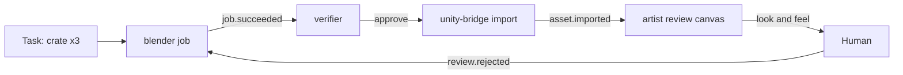

# Crew + Wrangler — Spec

Sep 25, 2026

## Boundaries

Two pieces run one vault's agent team. **crew** is a standalone Bun CLI and service: the manager and central comms for the team. **Wrangler** is the Obsidian plugin that runs crew's server and shows it as views inside Obsidian.

**What it is.** A documentation-driven development platform. Tasks, verdicts, traces and wiki pages are the project's documentation, written as the work happens, so the docs can't drift from what was built. The same records drive decisions, can be turned into new views or documents on demand, and make new agents quick to create. A game asset pipeline is one use case among many.

**Who it's for.** A solo builder who works inside Obsidian with an AI copilot (Copilot plugin, Claude, or another harness). The human and their copilot design, create, and supervise agents at a high level, and take hands-on tasks themselves alongside the agents.

**Vault only.** Every piece of state lives as files in the vault. One crew server runs per vault. crew shares no file formats with rbots or other systems. Other tools, including rbots agents, can still talk to crew through its CLI, HTTP API, or MCP endpoint.

**Platform.** crew runs on any desktop with Bun, with or without Obsidian open. Wrangler runs on Obsidian desktop. Obsidian mobile can read the board, logs and reviews once the vault syncs, but can't run agents.

**Principles**

- **crew is the only writer of shared state.** Agents, Wrangler, the human's copilot, and outside tools all go through crew to claim, post, emit and update. This prevents overlapping writes.
- **Trust by default, verify the output.** Agents act without asking. Their work lands in isolated work trees and is approved by a verifier agent, and by the human when escalated.
- **Long work runs as scripts, not sessions.** Agents start jobs and sleep until an event wakes them.
- **Tool-agnostic.** Each agent names its runner (Claude Code, OpenCode, others) and model.
- **Everything is traceable.** Every task, job, event, post, log line and wiki change carries a task ID and links back to it.

**Not in scope for v1:** multi-user vaults, cloud-hosted runners, a marketplace for agent packs.

## Architecture: crew and Wrangler

crew does all the work, so the team keeps running even when Obsidian is closed. Wrangler gives it a face inside Obsidian.

| Piece | What it is | Responsibilities |
| --- | --- | --- |
| crew | Bun CLI + long-running server (`crew serve --vault <path>`) | State broker, event bus, scheduler, agent launcher, job runner, locks, budgets, verification routing, trace builder |
| Wrangler | Obsidian plugin | Sets up `crew/` in a vault on first enable, starts `crew serve` for the vault or attaches to one already running, renders crew views, sends UI actions to crew |
| crew-manager skill | A skill folder in the vault | Teaches the human's AI copilot how to run the team through crew |
| wrangler-setup skill | A skill folder in the crew repo, fetched over HTTP | Teaches the human's AI copilot how to install Wrangler and bootstrap crew in a vault that doesn't have them yet |

**crew interfaces**

- **CLI:** `crew <command>`. Used by the human, the copilot, agents, and scripts.
- **Local HTTP API:** localhost only, with a token stored in `crew/crew.md`. Wrangler and outside tools use it.
- **Live stream:** a WebSocket feed of events, job output and status, for Wrangler's live views.
- **MCP endpoint:** the same commands as MCP tools, for harnesses that prefer MCP.

**Running modes**

- **Inside Obsidian:** Wrangler starts `crew serve` when the vault opens and stops it when Obsidian closes.
- **As a service:** crew runs under launchd or systemd. Wrangler detects it and attaches. Agents keep working with Obsidian closed.

**Install.** A user installs only Wrangler (`main.js`, `manifest.json`, `styles.css` from a GitHub release) into a vault's `.obsidian/plugins/wrangler/` and enables it. No Bun install or crew source checkout is required. On first enable in a vault, Wrangler creates the `crew/` folder layout, templates, wiki and skill from its own bundled copy of `vault-template/crew/` and `skill/crew-manager/`, and generates the API token in `crew/crew.md`. It then downloads the `crew` binary matching the host OS and architecture from crew's GitHub releases into its own plugin folder and runs it, unless a `crewCliPath` override is set in settings (for running crew from a source checkout instead). Both steps are safe to re-run and only act when the corresponding state (`crew/crew.md`, the downloaded binary) is missing.

## Vault layout

Everything crew manages lives under one folder. Heavy files (models, renders, video) stay in an external project folder, and the vault holds a small note per asset pointing to them.

```
crew/
  crew.md                 # settings: runners, locks, budgets, external paths, API token
  agents/
    <agent>/
      agent.md            # definition and directives
      memory.md           # agent's own long-term notes
      skills/
        <skill>/SKILL.md
        scripts/          # tested, reusable Bun/Python scripts
      logs/YYYY-MM-DD.md  # one log per day
  templates/
    agents/<template>.md  # agent templates with blanks to fill
  tasks/<task-id>.md      # one note per task
  board.md                # kanban view over tasks/
  blackboard/<timestamp>-<agent>.md   # one note per post, append-only
  events/YYYY-MM-DD.jsonl # event log, written only by crew
  jobs/<job-id>/
    job.md                # intent + wake plan
    run.log, result.json
  assets/<asset-id>.md    # thumbnail, external path, version, status
  reviews/<batch>.canvas  # review canvases
  traces/<task-id>.md     # generated timeline per task
  wiki/                   # conventions, decisions, how-tos
  worktrees/              # index of open work trees (the trees live outside the vault)
```

## Agent definition

An agent is a CLI invocation driven by its agent.md. The frontmatter says how and when it runs. The body holds its directives, and every agent inherits the standard workflow below.

```yaml
---
name: blender
enabled: true
runner: claude            # claude | opencode | any registered runner
model: sonnet
role: Headless Blender asset worker
can: [blender, mesh, rig, render]    # capabilities matched against tasks
schedule: "*/30 * * * *"            # optional heartbeat to check the board
subscribes: [asset.requested, job.succeeded, job.failed, job.timeout, review.rejected]
jobs:
  languages: [python, bun]
  max_concurrent: 2
  default_timeout: 15m
  locks: [gpu]
decider: none             # none | jev | local decider CLI
budget: { daily_usd: 3 }
paths:
  external: ["${ASSETS}/blender"]
wiki: [conventions/assets, conventions/naming]   # pages to read before working
---
```

**Standard workflow (inherited by every agent)**

1. On wake, read the wake payload, your memory.md, any job note you left, and the wiki pages listed in your frontmatter.
2. Find work: the task or event that woke you, or the next claimable task matching your `can` list.
3. Claim the task through crew before doing anything.
4. Do the work in a work tree. For anything over a minute, write a script and start it as a job, then write the job note and end your session.
5. On completion, record results in the task, move it to Verify, post a short summary to the blackboard, and log what you did. Link the task ID everywhere.
6. Save lasting lessons to memory.md. Promote a script that worked into skills/scripts/. Propose a wiki change when you learn a convention others need.
7. Never wait inside a session. Never edit another agent's folder.

## Creating agents

Agents are scaffolded from templates, then filled in by the human or their copilot. The copilot can design a new agent in the middle of a conversation and have it running minutes later.

```
crew agent new blender --template worker --runner claude --model sonnet --can blender,mesh,rig
crew agent lint blender
crew agent enable blender
```

1. `crew agent new` copies a template into `crew/agents/<name>/`, fills the known fields, and leaves `{{BLANK: ...}}` markers for everything else (role, directives, subscriptions, locks, wiki pages).
2. The copilot or human replaces each blank.
3. `crew agent lint` checks the frontmatter schema, runner and model availability, that no blanks remain, and that subscribed events and locks exist. A new agent stays disabled until lint passes. This is a completeness check, not a trust gate.
4. `crew agent enable` turns it on and posts `agent.created` to the blackboard.

`crew agent remove <name>` deletes an agent's folder for good. It refuses while the agent is enabled -- `crew agent disable` first -- and doesn't touch tasks the agent claimed; reassign or reclaim those separately.

The crew-manager skill includes `new-agent.sh`, a wrapper the copilot calls with the same arguments.

**Starter templates:** worker (does tasks from the board), bridge (connects to an outside app such as Unity or Blender), verifier, planner (breaks goals into tasks with acceptance criteria), watcher (reads logs and flags problems).

## Tasks and the board

Each task is its own note, and the kanban is a view over those notes. Tasks describe the outcome and the capability needed, so any engine's agent can take them. The human is a team member too and can claim tasks.

```yaml
---
id: T-0142
title: Low-poly cargo crate, 3 variants
needs: [blender, mesh]
status: ready            # inbox | ready | claimed | verify | review | done | blocked
claimed_by: null         # an agent name, or "human"
claim_expires: null
priority: normal
acceptance:
  - under 2,000 triangles each
  - shared material slots: body, trim, decal
  - exported as .glb to ${ASSETS}/props/crate/
parent: T-0120
worktree: null
---
```

**Claims.** Claims expire after a set time unless renewed by the agent or its running job. An expired claim returns the task to Ready. Human claims don't expire.

**Columns.** Inbox, Ready, Claimed, Verify, Review, Done, plus Blocked. Verify belongs to the verifier agent. Review only holds what the verifier escalates.

**Acceptance criteria are required** for a task to leave Inbox. They're what the verifier checks against.

## Blackboard and events

The blackboard is for messages people and agents read. Events are signals that wake agents. Both go through crew.

```
crew post "Crate v2 exported, trim slot renamed" --task T-0142 --topic props
crew emit asset.ready --task T-0142 --data '{"asset":"A-0311"}'
crew claim T-0142
crew task update T-0142 --status verify --note "3 variants, 1,840 tris max"
crew job run --task T-0142 --script skills/scripts/decimate.py --lock gpu --timeout 20m
```

crew appends every event to the day's log and wakes each agent that subscribes to it. Event names are free-form, so new agents can add their own.

**Standard events**

| Event | Sent by | Typical listener |
| --- | --- | --- |
| task.created, task.ready | crew | Agents with matching `can` |
| task.claimed, task.released | crew | Board view |
| task.verify | Worker agent | Verifier |
| job.started, job.progress | Job runner, script | Live run view |
| job.succeeded, job.failed, job.timeout | Job runner | The agent that started the job |
| asset.requested | Any agent or the human | Bridge agents |
| asset.ready, asset.imported | Worker, bridge | Next step in the chain |
| review.approved, review.rejected | Verifier or the human | Original worker |
| agent.created, agent.disabled | crew | Blackboard, watcher |
| lock.granted | crew | Queued job |
| budget.exceeded | crew | The human, the agent |

## Job contract

Agents do long work by writing a Bun or Python script, starting it as a job, and ending their session. The job runner guarantees a completion event, so an agent always wakes up, even if the script crashes.

1. The agent writes or picks a script and a job note (`jobs/<id>/job.md`) with the intent, what it's waiting for, and what to do on success or failure.
2. `crew job run` queues the job, waits for any lock, starts it, and sends `job.started`.
3. The agent ends its session. No tokens are spent while the job runs.
4. Exit code 0 sends `job.succeeded`. A non-zero exit or crash sends `job.failed`. Passing the time limit kills the job and sends `job.timeout`.
5. crew wakes the agent with its job note, the exit code, result.json, the last 50 lines of output, and the list of files produced.

**The time limit** (step 4) is not the same thing as a task claim's `claim_minutes` (Vault layout, `crew.md`) -- that's bookkeeping on the task record, checking whether an agent has gone silent. This is a real process watchdog on the job's script. Resolved in order: `--timeout` on `crew job run`, else the agent's own `jobs.default_timeout` in its agent.md, else crew.md's `limits.default_job_timeout` (15m if that's unset too). A long-running job should call `renew()` periodically (see below) to keep its task claim alive independently of this.

**Script helpers** (small libraries for Bun and Python)

```python
from crew import emit, result, renew
emit("progress", pct=40)
renew()                                      # keeps the task claim alive
result(files=["crate_v2.glb"], tris=1840)    # written to result.json
```

**Scripts become skills.** A script that succeeds can be promoted into `skills/scripts/` with a one-line description and its inputs. Agents check their scripts folder before writing a new one.

## Work trees, verification and approval

Agents never ask permission to act. Their work is isolated until approved, a verifier agent approves most of it, and the human sees only what it escalates.

**Work trees.** Every claimed task gets an isolated space: a git worktree on its own branch for code, or a staging folder for assets. Nothing reaches the main branch or the live project folder until approved, and then crew merges or copies it in.

**The verifier agent** listens for `task.verify`, ideally on a different model from the worker. For each task it runs the automated checks named in the acceptance criteria, compares the result against each acceptance line with evidence, checks consistency with the wiki and related tasks, and writes a verdict: approve, reject with reasons, or escalate. The approve-or-escalate call can go to the `decider` (Jev or the local decider).

- **Approve:** checks pass and confidence is high. Merged, Done, `review.approved`.
- **Reject:** checks fail. Back to the worker with reasons. Escalated after two rejections.
- **Escalate:** low confidence, criteria that can't be checked automatically (look and feel, story, balance), protected areas listed in crew.md, or cost over a threshold. The default protected areas are main branch config, released builds, and canon lore.

**Review briefs.** Each escalation is a five-line summary, what changed, the evidence, and the verifier's concern. Visual work opens in a review canvas side by side.

**Keeping the verifier honest.** One in ten auto-approvals is sampled into Review. Disagreements are saved to the verifier's memory.md.

## Traceability and the wiki

Every piece of work can be followed from the goal to the final file. The wiki holds the knowledge agents and the human share.

**Trace links.** Every event, post, job, log entry and commit message carries its task ID, and log entries link it as `[[T-0142]]`, so Obsidian backlinks work out of the box. Commits in work trees use the format `T-0142: <summary>`.

**`crew trace T-0142`** writes `traces/T-0142.md`: one timeline of claims, jobs, events, posts, verdicts, files produced, and wiki pages touched, with links to each.

**The wiki** (`crew/wiki/`) holds conventions, decisions and how-tos. Agents read the pages listed in their frontmatter before working. The verifier checks work against them. Agents propose wiki changes in their work tree, and those changes go through verification like any other work.

## Working alongside the crew

The human and their copilot manage the team through the same CLI, guided by the crew-manager skill.

| Need | Command |
| --- | --- |
| What's happening now | `crew status` |
| Read an agent's recent work | `crew logs blender --since 2h` |
| Check work against its spec | `crew audit T-0142` (runs the verifier's checks on demand and reports gaps) |
| Follow a task end to end | `crew trace T-0142` |
| Plan work | `crew task new "..." --needs blender --accept "..."` |
| Take a task yourself | `crew claim T-0142 --as human` |
| Design a new agent | `crew agent new ...`, fill blanks, `crew agent lint`, `crew agent enable` |
| Stop everything | `crew stop --all` |

## Locks, budgets and limits

These are the only controls that stop work. They protect machines and money, not trust.

- **Locks:** named resources in crew.md, such as `gpu`, `unity-editor` and `blender`. A job needing a taken lock waits and starts on `lock.granted`.
- **Budgets:** daily spend limits per agent and for the whole team. At the limit, that agent's new sessions pause and `budget.exceeded` is sent. Running jobs finish.
- **Concurrency:** a cap on simultaneous agent sessions and on simultaneous jobs.
- **Kill switch:** `crew stop --all` stops every session and job, releases every lock, and returns every agent claim to Ready.
- **Paths:** agents write inside their own folder, their work trees, and the external paths listed in their agent.md.

## Wrangler views

The views answer three questions at a glance: what's running, what's stuck, and what needs me.

**Visual identity.** Wrangler keeps its own look across any Obsidian theme, the way plugins like Excalidraw or Kanban do -- `styles.css` defines its own `--crew-*` tokens (palette, type, motion) rather than only inheriting Obsidian's theme variables, following the vault's light/dark toggle via `body.theme-light`/`body.theme-dark` but not a specific community theme's exact colors. Agent and job state is always shown with a shape and a word, never color alone; a status dot adds a subtle continuous pulse for `running`/`sleeping` agents (`prefers-reduced-motion` disables it, leaving color and shape). `packages/wrangler/plans/animation-plans/` holds the motion audit and rationale for what does and doesn't animate -- notably, the periodic view refresh and status-bar text updates are deliberately not animated, since they repeat every few seconds and would be noise, not polish.

| View | Where | Shows | Main actions |
| --- | --- | --- | --- |
| Crew sidebar | Right pane | Each agent: status, current task, last log line, runner and model, spend today | Run now, pause, stop, open agent.md |
| Server panel | Right pane tab | crew server status, mode (plugin or service), uptime, connected tools | Start, stop, restart, copy API token |
| Board | Main tab | Columns Inbox to Done, owner, claim timer, `needs` tags, verdict | Create task, drag, assign, claim as human |
| Review inbox | Main tab | Escalated briefs and sampled auto-approvals | Approve, reject with note, add criterion |
| Review canvas | Canvas file | Asset variants side by side in Approved, Revise, Rejected groups | Drag cards between groups |
| Blackboard feed | Main tab | Posts and events on one timeline | Post, filter, jump to task or job |
| Agent page | Rendered agent.md | Header card, tabs for Memory, Skills, Scripts, Logs | Edit directives, lint, enable |
| Jobs view | Main tab | Queued, running and finished jobs, waiting locks, live output | Kill, rerun, open job note |
| Trace view | Task note | Timeline from `crew trace` | Open any linked item |
| Status bar | Bottom | "crew ● 3 running · 2 sleeping · 1 needs review · $1.40 today" | Open Review inbox |

**Spawn agent form.** Wrangler probes the host for known AI CLIs (Claude Code, Codex, opencode, Cursor) on PATH and offers detected ones in the Runner dropdown. Where a tool documents a live model-listing command (opencode) it queries it; where only known aliases exist (Claude Code: sonnet/opus/haiku) it uses a static list; otherwise the Model field falls back to free text. Detection is a convenience for the form, not a guarantee the runner works end to end: if the chosen runner has no matching entry under `runners:` in `crew/crew.md`, Wrangler creates the agent (it starts disabled either way) and shows a suggested config snippet to add, since crew.md is the human's own settings note and Wrangler doesn't write it for them.

**Updating Wrangler.** Settings has a "Check for updates" button: it compares the installed version against crew's latest GitHub release tag and, if newer, downloads `main.js`/`manifest.json`/`styles.css` in place. Reloading Obsidian picks up the update.

## Example team: game asset pipeline

Five agents share one board and produce game-ready assets without knowing how the others work. Swapping the Unity bridge for a Godot bridge changes nothing else.

| Agent | `can` | Tools and scripts |
| --- | --- | --- |
| blender | blender, mesh, rig, render | Headless `blender -b -P script.py`, a library of bpy scripts |
| unity-bridge | unity, import, export | Talks to UAssist in the Unity project, imports assets, exports rigs and prefabs on request |
| cutscene | video, cutscene | LTX video generation scripts, shot assembly |
| artist | layout, review-canvas | Review canvases, contact sheets, turnaround layouts |
| verifier | verify | Validators, tests, wiki checks, the decider |



## Build phases

1. **crew core, headless:** `crew serve`, vault layout, agent.md parsing, runner adapters for Claude Code and OpenCode, tasks and claims, events, logs, `crew status` and `crew logs`. Done when one agent claims a task, does it and moves it to Verify, with Obsidian closed.
2. **Jobs and agent scaffolding:** job runner with timeouts and locks, Bun and Python helpers, `crew agent new/lint/enable`, templates, the crew-manager skill. Done when the copilot designs a new agent from a conversation and it completes a scripted job.
3. **Wrangler views:** server panel, crew sidebar, board, jobs view, blackboard feed, status bar.
4. **Verification and trace:** work trees, verifier agent, review briefs, Review inbox, sampling, `crew audit`, `crew trace`, wiki conventions.
5. **Polish:** review canvases, budgets, service mode, HTTP token rotation, decider integration, MCP endpoint.

## Future: protections outside Obsidian

Obsidian with Wrangler is the target today. Harnesses like Claude Code or OpenCode can already run the team through the crew CLI and get crew's rules: claims, locks, budgets, work trees and verification. What crew can't stop yet is a harness writing vault files directly instead of calling crew. These additions close that gap later, and they are not part of v1.

1. **Event log as the source of truth.** Task notes and the board are rebuilt from `events/`. A hand-edited task note that doesn't match the log is flagged and restored from the log.
2. **Folder watch.** crew watches `crew/`. Any write it didn't make fires `state.tampered` with the file and the diff, and the item lands in the Review inbox.
3. **Sandboxed agent launches.** crew passes each runner its own permission settings (allowed directories, allowed tools), so an agent can only write to its folder, its work tree and its external paths. The human's own copilot session stays unrestricted.

## Open questions

- [ ] What confidence level lets the verifier auto-approve, and should it differ by task type? The scaffold defaults to tiers plus earned trust (`verify` in crew.md): asset and docs can earn auto-approval, code also needs a second agent's approval, everything else goes to the human, and a type earns auto-approval after 20 human reviews at 95% agreement. Change it in crew.md.
- [ ] Should the watcher agent run on a schedule, or only when the human asks? The scaffold defaults to problem-triggered: crew emits `crew.anomaly` for repeated failures, expiring claims and budget stops, and the watcher template subscribes to it. It also runs on command with `crew wake watcher`. A daily digest is a blank in the watcher template.
