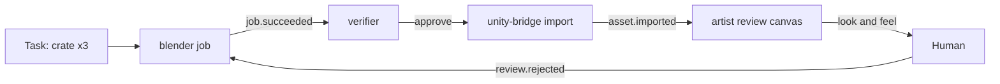

# Crew + Wrangler — Spec

Sep 27, 2026

## Boundaries

Two pieces run one vault's agent team. **crew** is a standalone Bun CLI and service: the manager and central comms for the team. **Wrangler** is the Obsidian plugin that runs crew's server and shows it as views inside Obsidian.

**What it is.** A documentation-driven development platform. Tasks, verdicts, traces and wiki pages are the project's documentation, written as the work happens, so the docs can't drift from what was built. The same records drive decisions, can be turned into new views or documents on demand, and make new agents quick to create. A game asset pipeline is one use case among many.

**Who it's for.** A solo builder who works inside Obsidian with an AI copilot (Copilot plugin, Claude, or another harness). The human and their copilot design, create, and supervise agents at a high level, and take hands-on tasks themselves alongside the agents.

**Vault only.** Every piece of state lives as files in the vault. One crew server runs per vault. crew shares no file formats with rbots or other systems. Other tools, including rbots agents, can still talk to crew through its CLI or HTTP API. (An MCP endpoint is planned but not built yet -- see "Not yet built" below.)

**Platform.** crew runs on any desktop with Bun, with or without Obsidian open. Wrangler runs on Obsidian desktop. Obsidian mobile can read the board, logs and reviews once the vault syncs, but can't run agents.

**Principles**

- **crew is the only writer of shared state.** Agents, Wrangler, the human's copilot, and outside tools all go through crew to claim, post, emit and update. This prevents overlapping writes.
- **Trust by default, verify the output.** Agents act without asking. Their work lands in isolated work trees and is approved by a verifier agent, and by the human when escalated.
- **Long work runs as scripts, not sessions.** Agents start jobs and sleep until an event wakes them.
- **Tool-agnostic.** Each agent names its runner (Claude Code, OpenCode, others) and model.
- **Everything is traceable.** Every task, job, event, post, log line and wiki change carries a task ID and links back to it.

**Not in scope for v1:** multi-user vaults, cloud-hosted runners, a marketplace for agent packs.

*A note on "v1" here:* this section describes the original one-server-per-vault design (below, "the machine service" section calls this **v0** for clarity, matching a newer architecture doc). A separate, additive direction -- one crew service per machine, hosting many registered projects -- is being built in phases on top of it; see that section for what exists today versus what's still ahead.

## Architecture: crew and Wrangler

crew does all the work, so the team keeps running even when Obsidian is closed. Wrangler gives it a face inside Obsidian.

| Piece | What it is | Responsibilities |
| --- | --- | --- |
| crew | Bun CLI + long-running server (`crew serve --vault <path>`) | State broker, event bus, scheduler, agent launcher, job runner, locks, budgets, verification routing, trace builder |
| Wrangler | Obsidian plugin | Sets up `crew/` in a vault on first enable, starts `crew serve` for the vault or attaches to one already running, renders crew views, sends UI actions to crew |
| crew-manager skill | A skill folder in the vault | Teaches the human's AI copilot how to run the team through crew |
| wrangler-setup skill | A skill folder in the crew repo, fetched over HTTP | Teaches the human's AI copilot how to install Wrangler and bootstrap crew in a vault that doesn't have them yet |

**crew interfaces**

- **CLI:** `crew <command>`. Used by the human, the copilot, agents, and scripts.
- **Local HTTP API:** localhost only, with a token stored in `crew/crew.md` (v0) or `~/.crew/crew.md` (machine service). Wrangler and outside tools use it.
- **Dashboard:** `GET /` on either server serves a small static HTML page -- no build step, dependency-free JS, styled as a ToolwrightTheme "app page" (always dark, no light mode) -- for running crew from a plain browser instead of only from inside Obsidian. Exempt from the token check the way `/health` is (it's just markup), but every actual data or command call it makes (`/status`, `/projects`, `/review`, `/questions`, `/tasks`, `/cmd`) still needs the real token, pasted in once and kept in the browser's `localStorage`. Auto-detects v0 vs. machine mode from `/health`'s shape and polls every 5s. A project's detail view shows its full task list (color-coded by status) and a "Needs you" section -- escalated/sampled tasks and open questions -- with Approve/Reject/Agree/Disagree and Reply buttons that call `/cmd` directly, the same endpoint Wrangler uses. Pausing a project is still Wrangler/CLI-only.
- **Live stream:** a WebSocket feed of events, job output and status, for Wrangler's live views.
- **MCP endpoint:** the same commands as MCP tools, for harnesses that prefer MCP.

**Running modes**

- **Inside Obsidian:** Wrangler starts `crew serve` when the vault opens and stops it when Obsidian closes.
- **As a service:** crew runs under launchd or systemd. Wrangler detects it and attaches. Agents keep working with Obsidian closed.

**Install.** `scripts/install-wrangler.sh` installs Wrangler's three files (`main.js`, `manifest.json`, `styles.css`) into a vault's `.obsidian/plugins/wrangler/`, and installs `crew` itself globally to `~/.local/bin/crew` (best effort -- skipped on an unrecognized OS/arch) so `crew status` and the rest of the CLI work from any terminal, not only as something Wrangler spawns. No Bun install or crew source checkout is required. On first enable in a vault, Wrangler resolves the crew binary first (downloading it into the plugin folder if no global install exists yet) and runs `crew init <vault path>` -- the same scaffolding a headless setup or `crew init` from a terminal does, so there's one source of truth for what a fresh `crew/` looks like instead of Wrangler carrying its own bundled copy of `vault-template/crew/`. To start the server it prefers the global `~/.local/bin/crew` if present; otherwise it uses the copy it downloaded, unless a `crewCliPath` override is set in settings (for running crew from a source checkout instead). All of this is safe to re-run and only acts when the corresponding state is missing.

## The machine service (many projects, one port) -- Phase 1 of a larger direction

**The law change.** The original design (call it v0, above) runs one `crew serve --vault <path>` process per vault, every one defaulting to port 7717 -- so two projects' servers can never run at once on one machine, there's no way to share locks or a budget across projects, and handing work between projects needs an outside relay. v1 replaces that with: **one crew service per machine, many registered projects.** Each project still owns its own files and state under its own `crew/` folder; the service owns the process, the port, and routing between projects. Delete the service and every project still reads as plain files.

**What's built (Phase 1 -- "one service").** This is what exists today:

- `crew init [path] [--id name]` scaffolds `crew/` in *any* folder -- an Obsidian vault, a git repo, or a plain directory -- and registers it with the machine, with a permanent short id (`slugify(folder name)` by default, 2-24 lowercase letters/digits/dashes, or an explicit `--id`). This is the same scaffolding v0's `scripts/init-vault.sh` does, ported into the compiled binary via the same embed-and-materialize pattern already used for job helpers, so there's one source of truth instead of that script and Wrangler's own bundled copy independently agreeing on what a fresh `crew/` looks like.
- `crew serve` with **no** `--vault` (and no `CREW_VAULT` set) runs the **machine service**: it loads every project registered with `status: active` into a `Map<projectId, ...>`, one shared `Bun.serve`, one tick loop -- each project's dispatcher runs in its own try/catch, so a problem in one project never stops another's agents. `crew serve --vault <path>` still runs the original v0 single-project mode, byte-for-byte unchanged -- it refuses to start against a path that's already registered `active` in the machine service (a clear error instead of a silent port collision, since both default to 7717).
- **Machine home**, `~/.crew/` (override with `CREW_HOME`, mainly for tests): `crew.md` (machine settings: port, machine token; `runners`/`locks`/`budget`/`limits` fields exist in the schema for later phases but are inert today) and `projects.md` (the registry -- a YAML-frontmatter note like any other crew file, `projects: { id: { path, kind, status } }`).
- `crew projects` / `crew project add <path> [--id]` / `crew project pause|resume <id>` / `crew project remove <id>` manage the registry. A project's `kind` is detected, not declared: `.obsidian/` -> vault, `.git/` -> repo, else folder. `crew project add` refuses a path with a *live* v0 server already running there, so an existing per-vault install can't get double-dispatched by also being loaded into the machine service.
- `crew service install|uninstall|status` runs the machine service under launchd/systemd, under a distinct label (`com.crew.machine` / `crew-machine.service`) from v0's per-vault `scripts/service.sh` units, so installing one never touches the other.
- **Restart resumes, not skips.** v0 seeds its event-tailing offset at each file's current end on start ("don't replay history") -- exactly right for one long-lived `--vault` process, but it would lose events written while the *machine* service itself was down. The machine service instead persists each project's read offset to `~/.crew/.state/offsets.json`, so a job that finishes while the service is restarting still wakes its agent once it's back up.
- The registry (`projects.md`) is polled for changes once per tick (mtime check), the same file-polling approach crew already uses for events and schedules -- so `crew init`/`crew project add` register a project with no service restart needed.
- **`crew migrate <path>`** brings an existing v0 vault into the registry: stops its own live server if one's running, removes any `scripts/service.sh` launchd/systemd unit for it (a distinct label scheme from the machine service's own, so removing one never touches the other), registers it, and splits its settings -- drops `api.port` from its `crew.md` (now machine-owned) via a targeted line edit, keeping its `token` as this project's own project-tier token. Safe to re-run; the machine service picks up the registration within a tick, no restart.
- **Wrangler attaches to the machine service whenever one is healthy, for any vault** -- not gated on that vault having been migrated first. On load, it checks for a running machine service; if healthy, it looks the vault up by path. Found and active: attach, no child process spawned, every read/write goes through `/p/<id>/*` instead of the vault owning its own server. Found and paused: a "paused" state with a resume button. Not found: an existing v0 vault (has `crew/crew.md`) gets **auto-migrated** (`crew migrate` itself safely stops that vault's own live server first, so this handles a currently-running legacy server too, not just a cold one); a vault with no `crew/` at all gets the same `crew init` call `ensureVaultSetup()` already made. If no machine service is healthy, Wrangler falls back to exactly its original behavior -- spawning its own `crew serve --vault <path>` when `autoStart` is on. "Stop" in attach mode means `crew project pause <id>`, never touching the shared service (closing Obsidian never stops it either, since other projects may depend on it). A new **All crews** view (`GET /projects`) shows every registered project at once, with pause/resume, independent of which vault Wrangler is actually open in.

- **Qualified ids** (`art:T-0311`) let a human on the terminal reference another registered project's item directly, without `--project`. A qualified id in the arguments joins `--project`/`CREW_PROJECT` at the same resolution priority (right after `--vault`/`CREW_VAULT`, which always wins outright); the matched arg's `art:` prefix is stripped before the cleaned argv reaches the target project, so no local command needs to know qualified ids exist. Scoped to the CLI edge only, on purpose: a positional arg is only ever treated as qualified when its project half matches a *registered* project id, so this can never misfire on an argument that merely contains a colon. No wire-format change, no auth implication either way.

- **Fleet rollup for outside monitors.** Authenticated `GET /dispatcher` returns one project's digest in v0 mode and every active project's in machine mode (`{ projects: [{ id, paused, agents, tasks, review[], questions[], blocked[], jobs, spend }] }`) -- agent states plus the actionable ID lists, so a watcher (e.g. Ronin's dispatcher duty) needs one call instead of several per project.

**Not yet built (later phases, same numbering as the architecture doc this followed):** per-session tokens and enforcing that agent sessions/jobs go through the service, cross-project grants and links (`crew://`, cross-project trace), machine-wide lock/budget/session-cap *enforcement* (the config fields exist, inert), the crews dashboard, and the `/mcp` endpoint. A design for the full session-tokens/grants/cross-project-task-request model exists (`plans/crew-v1-phase1-migrate-qualified-ids.md`) but the next phase actually planned is narrower: cross-project **event propagation only** -- an agent in one project subscribing to and waking on another registered project's events, without tokens, grants-as-permission-checks, or cross-project task requests. None of any of this touches an existing v0 vault's files or config unless the machine service happens to be healthy *at the moment that vault is opened* -- starting one at all is still a separate, deliberate action (`crew serve` with no `--vault`, or `crew service install`).

## Vault layout

Everything crew manages lives under one folder. Heavy files (models, renders, video) stay in an external project folder, and the vault holds a small note per asset pointing to them.

```
crew/
  crew.md                 # settings: runners, locks, budgets, external paths, API token
  agents/
    <agent>/
      agent.md            # definition and directives
      memory.md           # agent's own long-term notes
      skills/
        <skill>/SKILL.md
        scripts/          # tested, reusable Bun/Python scripts
      logs/YYYY-MM-DD.md  # one log per day
  templates/
    agents/<template>.md  # agent templates with blanks to fill
  tasks/<task-id>.md      # one note per task
  board.md                # kanban view over tasks/
  blackboard/<timestamp>-<agent>.md   # one note per post, append-only
  events/YYYY-MM-DD.jsonl # event log, written only by crew
  jobs/<job-id>/
    job.md                # intent + wake plan
    run.log, result.json
  assets/<asset-id>.md    # thumbnail, external path, version, status
  reviews/<batch>.canvas  # review canvases
  traces/<task-id>.md     # generated timeline per task
  wiki/                   # conventions, decisions, how-tos
  worktrees/              # index of open work trees (the trees live outside the vault)
```

## Agent definition

An agent is a CLI invocation driven by its agent.md. The frontmatter says how and when it runs. The body holds its directives, and every agent inherits the standard workflow below.

```yaml
---
name: blender
enabled: true
runner: claude            # claude | opencode | any registered runner
model: sonnet
role: Headless Blender asset worker
can: [blender, mesh, rig, render]    # capabilities matched against tasks
schedule: "*/30 * * * *"            # optional heartbeat to check the board
subscribes: [asset.requested, job.succeeded, job.failed, job.timeout, review.rejected]
jobs:
  languages: [python, bun]
  max_concurrent: 2
  default_timeout: 15m
  locks: [gpu]
decider: none             # none | jev | local decider CLI
budget: { daily_usd: 3 }
paths:
  external: ["${ASSETS}/blender"]
wiki: [conventions/assets, conventions/naming]   # pages to read before working
---
```

**Standard workflow (inherited by every agent)**

1. On wake, read the wake payload, your memory.md, any job note you left, and the wiki pages listed in your frontmatter.
2. Find work: the task or event that woke you, or the next claimable task matching your `can` list.
3. Claim the task through crew before doing anything.
4. Do the work in a work tree. For anything over a minute, write a script and start it as a job, then write the job note and end your session.
5. On completion, record results in the task, move it to Verify, post a short summary to the blackboard, and log what you did. Link the task ID everywhere.
6. Save lasting lessons to memory.md. Promote a script that worked into skills/scripts/. Propose a wiki change when you learn a convention others need.
7. Never wait inside a session. Never edit another agent's folder.

## Creating agents

**Every vault ships with five agents already scaffolded, generic enough to need no per-vault customization: `verifier` (enabled), `planner`, `scout`, `devops` and `watcher` (all four disabled).** All five come pre-filled -- no `{{BLANK: ...}}` markers -- unlike blender/blogger/bridge-style agents, which are genuinely project-specific.

- `verifier` is enabled by default because nothing else is generic and mandatory the way it is: without it, tasks reach `verify` and sit there forever, since nothing is listening for `task.verify` to run `crew audit` and call `crew verdict`. Human review only replaces this for an escalated or sampled task, not the first pass. Runner `claude`, model `opus` (deliberately different from a typical worker's `sonnet`), `subscribes: [task.verify]`, no `can` (it doesn't claim tasks).
- `planner`, `scout`, `devops` and `watcher` ship disabled -- useful, but not everyone wants a second agent proposing, organizing or intervening in work from day one, and all four cost real spend once enabled. `planner` wakes on `planner.request` with a goal to break into tasks; `scout` wakes on a schedule (ships set to `"0 8 * * *"`, daily -- change to `"0 8 * * 1"` for weekly, or any cron that fits) and surveys recent events, logs and files to propose tasks (to Inbox, without acceptance criteria, so nothing runs without a human or another agent picking it up) and post agent ideas to the blackboard under `agent-ideas`, never scaffolding them itself. `devops` is a worker scoped to the vault's own tooling and process (`can: [devops]`, wakes on `task.ready` like any worker) rather than project content -- it's what `scout` means when it tags an infra proposal `needs: devops` instead of reusing a real content agent's capability. Unlike a typical worker it also knows when *not* to just start working: if a claimed task's acceptance criteria are missing, or the work clearly needs more than one capability or more than one pass, it emits `crew emit planner.request --data '{"goal": "..."}'` and blocks the task rather than improvising a plan mid-task -- that handoff only does something once `planner` is also enabled. `watcher` subscribes to `crew.anomaly`, `budget.exceeded`, `task.blocked` and `watcher.request`, `can: []` (it never claims a task). For an anomaly or a budget stop it stays purely advisory -- one blackboard brief under `--topic alerts`, never a retry. For `task.blocked` it's allowed to act, but only inside a narrow, explicit allow-list: releasing a stale claim, or adding a config value (a `jobs.locks` entry, a wiki page reference) the blocked note names exactly and that's missing from crew.md or the agent's own frontmatter. Anything wider -- a deletion, a `protected` area or `--protected` task, widening a runner's permission mode, a budget change, enabling/disabling another agent, or anything it isn't fully certain is safe and reversible -- always escalates with a brief instead, and the task stays blocked for a human to decide. `crew agent enable planner` / `scout` / `devops` / `watcher` turns any of them on; check `crew agents` before scaffolding a fresh one from templates, since one already exists.

Everything else is scaffolded from templates, then filled in by the human or their copilot. The copilot can design a new agent in the middle of a conversation and have it running minutes later.

```
crew agent new blender --template worker --runner claude --model sonnet --can blender,mesh,rig
crew agent lint blender
crew agent enable blender
```

1. `crew agent new` copies a template into `crew/agents/<name>/`, fills the known fields, and leaves `{{BLANK: ...}}` markers for everything else (role, directives, subscriptions, locks, wiki pages).
2. The copilot or human replaces each blank.
3. `crew agent lint` checks the frontmatter schema, runner and model availability, that no blanks remain, and that subscribed events and locks exist. A new agent stays disabled until lint passes. This is a completeness check, not a trust gate.
4. `crew agent enable` turns it on and posts `agent.created` to the blackboard.

`crew agent show <name>` prints the agent's frontmatter summary (runner, model, can, subscribes, budget, wiki) and the paths to its files.

`crew agent edit <name>` opens `crew/agents/<name>/agent.md` in `$EDITOR` so you can change directives, role, subscriptions, or wiki list. After editing, run `crew agent lint <name>` to re-validate.

`crew agent memory <name>` opens `crew/agents/<name>/memory.md` in `$EDITOR`. This is the agent's own long-term notes; agents read it on every wake and append lessons as they work.

`crew agent set <name> --runner x --model y` changes an existing agent's runner and/or model in place, without touching anything else in its agent.md -- the only way to do this before was hand-editing the YAML frontmatter, which is exactly as error-prone as it sounds for a model name you don't have memorized. Wrangler's sidebar has an **Edit** button per agent that reuses the same runner/model detection the spawn-agent form uses (a live model list where the runner supports one, e.g. `opencode models`) rather than a blank text field.

`crew agent remove <name>` deletes an agent's folder for good. It refuses while the agent is enabled -- `crew agent disable` first -- and doesn't touch tasks the agent claimed; reassign or reclaim those separately.

**Agent packs.** `crew install <pack.zip> [--force]` copies a pack's agents into *this
project's* `crew/` -- the project in the current directory. It refuses to run anywhere
else: with no `crew/crew.md` found walking up from cwd it fails with "can only be
installed into a project, not globally at this time" (no `--vault`/`--project`
override; over HTTP the server's own project applies). Layout inside the zip:
`agents/<name>/agent.md` (+ `memory.md`, `skills/`), optional `wiki/` pages, optional
`pack.json` (`{name, version, agents: [{name, enabled}]}`). Overwrites are backed up to
`crew/.state/pack-backups/`, skipped without `--force`; each installed agent is linted
and only enabled when lint passes. The shipped packs and the pack format are
documented in `docs/agent-packs.md`.

**Pipeline fields.** `crew task new`/`crew task update` accept repeatable
`--field key=value`, stored as `### key` subsections under a `## Pipeline` heading in
the task body -- structured per-task state (`target`, `promptEnhanced`, `attempts`,
`artifacts`, `feedback`) that survives `saveTask`'s frontmatter overwrite and shows up
parsed as `pipeline` in `crew task show --json`. Agents update only their own stage's
fields and `needs`.

The crew-manager skill includes `new-agent.sh`, a wrapper the copilot calls with the same arguments.

**Starter templates:** worker (does tasks from the board), bridge (connects to an outside app such as Unity or Blender), verifier, planner (breaks goals into tasks with acceptance criteria, on request), watcher (explains anomalies and budget stops, and is the first responder to a blocked task -- resolves the narrow, low-risk cases itself and escalates the rest, especially deletions and protected areas), scout (schedule-driven: surveys the project and proposes tasks -- to Inbox, without acceptance criteria, so nothing runs without a human or another agent picking it up -- and posts agent ideas to the blackboard under `agent-ideas`, never scaffolding them itself), devops (a worker scoped to the vault's own tooling and process rather than project content, that hands off to planner instead of improvising a plan for a task that needs breaking down first). Opt-in like any other template; only `verifier` is pre-enabled by default.

## Tasks and the board

Each task is its own note, and the kanban is a view over those notes. Tasks describe the outcome and the capability needed, so any engine's agent can take them. The human is a team member too and can claim tasks.

```yaml
---
id: T-0142
title: Low-poly cargo crate, 3 variants
needs: [blender, mesh]
status: ready            # inbox | ready | claimed | verify | review | done | blocked
claimed_by: null         # an agent name, or "human"
claim_expires: null
priority: normal
acceptance:
  - under 2,000 triangles each
  - shared material slots: body, trim, decal
  - exported as .glb to ${ASSETS}/props/crate/
parent: T-0120
worktree: null
---
```

**Claims.** Claims expire after a set time unless renewed by the agent or its running job. An expired claim returns the task to Ready. Human claims don't expire.

**Columns.** Inbox, Ready, Claimed, Verify, Review, Done, plus Blocked. Verify belongs to the verifier agent. Review only holds what the verifier escalates.

**Acceptance criteria are required** for a task to leave Inbox. They're what the verifier checks against.

## Questions: agents ask, you answer

A task is a deliverable with acceptance criteria; a question is an agent asking the human
something open-ended -- an interview, a judgment call mid-task, anything that isn't "do this and
I'll check it." One note per question, same shape as a task.

```yaml
---
id: Q-0001
agent: second-brain-interviewer
topic: People (Tyrone + Charon)
task: null                 # an optional related task id
status: open                # open | answered
answered_by: null
answered_at: null
created: 2026-09-27T18:56:00.000Z
---

# People (Tyrone + Charon)

1. How did you and Tyrone start working together...
```

`crew question new "<topic>" --text "<question>" [--task id]` creates one, as whichever agent
calls it (same actor inference as `task new`/`post` -- no separate `--for` flag). It emits
`question.asked` but doesn't wake anyone; the point is to notify the human, not another agent.
Wrangler's Review view shows every open question with an Answer box, and the status bar counts
them alongside review/blocked. `crew question answer <id> "<answer>"` appends the answer to the
note, marks it answered, and emits `question.answered` -- which wakes only the asking agent (same
targeting-by-agent-field as `job.*`/`review.*` events), with the answer text in the event data so
the agent's wake prompt carries it without needing to re-read anything.

## Blackboard and events

The blackboard is for messages people and agents read. Events are signals that wake agents. Both go through crew.

```
crew post "Crate v2 exported, trim slot renamed" --task T-0142 --topic props
crew emit asset.ready --task T-0142 --data '{"asset":"A-0311"}'
crew claim T-0142
crew task update T-0142 --status verify --note "3 variants, 1,840 tris max"
crew job run --task T-0142 --script skills/scripts/decimate.py --lock gpu --timeout 20m
```

crew appends every event to the day's log and wakes each agent that subscribes to it. Event names are free-form, so new agents can add their own.

**Standard events**

| Event | Sent by | Typical listener |
| --- | --- | --- |
| task.created, task.ready | crew | Agents with matching `can` |
| task.uncoverable | crew (a `task.created` whose `needs` no *enabled* agent's `can` covers) | planner |
| task.claimed, task.released | crew | Board view |
| task.verify | Worker agent | Verifier |
| job.started, job.progress | Job runner, script | Live run view |
| job.succeeded, job.failed, job.timeout | Job runner | The agent that started the job |
| asset.requested | Any agent or the human | Bridge agents |
| asset.ready, asset.imported | Worker, bridge | Next step in the chain |
| review.approved, review.rejected | Verifier or the human | Original worker |
| question.asked | Agent (`crew question new`) | Wrangler's Review view, the human |
| question.answered | Human (`crew question answer`) | The asking agent |
| agent.created, agent.disabled | crew | Blackboard, watcher |
| lock.granted | crew | Queued job |
| budget.exceeded | crew | The human, the agent |

## Job contract

Agents do long work by writing a Bun or Python script, starting it as a job, and ending their session. The job runner guarantees a completion event, so an agent always wakes up, even if the script crashes.

1. The agent writes or picks a script and a job note (`jobs/<id>/job.md`) with the intent, what it's waiting for, and what to do on success or failure.
2. `crew job run` queues the job, waits for any lock, starts it, and sends `job.started`.
3. The agent ends its session. No tokens are spent while the job runs.
4. Exit code 0 sends `job.succeeded`. A non-zero exit or crash sends `job.failed`. Passing the time limit kills the job and sends `job.timeout`.
5. crew wakes the agent with its job note, the exit code, result.json, the last 50 lines of output, and the list of files produced.

**The time limit** (step 4) is not the same thing as a task claim's `claim_minutes` (Vault layout, `crew.md`) -- that's bookkeeping on the task record, checking whether an agent has gone silent. This is a real process watchdog on the job's script. Resolved in order: `--timeout` on `crew job run`, else the agent's own `jobs.default_timeout` in its agent.md, else crew.md's `limits.default_job_timeout` (15m if that's unset too). A long-running job should call `renew()` periodically (see below) to keep its task claim alive independently of this.

**Concurrency.** `crew.md`'s `limits.max_jobs` caps how many jobs run at once across every agent. An agent's own `jobs.max_concurrent` caps how many of *that* agent's jobs run at once, tighter than the global cap if set (a GPU-bound agent might cap itself at 1 even though the vault allows 4 overall). A job past either cap sits `queued` and fires `job.waiting` until a slot frees up.

**Script helpers** (small libraries for Bun and Python)

```python
from crew import emit, result, renew
emit("progress", pct=40)
renew()                                      # keeps the task claim alive
result(files=["crate_v2.glb"], tris=1840)    # written to result.json
```

**Scripts become skills.** A script that succeeds can be promoted into `skills/scripts/` with a one-line description and its inputs. Agents check their scripts folder before writing a new one.

**How crew re-invokes itself.** `crew wake` and `crew job run` both start a detached child that re-runs the same binary (`crew session <agent> <wakefile>`, `crew job exec <id>`). `bun bin/crew.ts` and a `bun build --compile` binary need different argv for this: Bun injects its own `["bun", "<virtual /$bunfs/ path>"]` pair ahead of real args in a compiled binary, so the extra script-path argument dev mode needs would shift every real argument over by one in compiled mode -- the subcommand silently never dispatches (`SELF_ARGS` in `jobs.ts` picks the right shape by checking for the `/$bunfs/` prefix; plain `existsSync` can't tell the two cases apart, since Bun's own fs functions recognize that prefix as "existing"). The same compiled-vs-dev gap affects the script helpers: `CREW_HELPERS`/`PYTHONPATH` used to be derived from the running binary's own path, which resolves to nothing on disk for a compiled binary with no sibling files. Fixed by embedding `packages/helpers/**` as strings at build time and materializing them into the vault's `crew/.state/helpers/` on first use instead of deriving a path -- works identically in both modes. `scripts/smoke-test.sh` compiles crew for the host platform and exercises both self-respawn paths for exactly this reason: every other check in that file runs through `bun bin/crew.ts` and would never catch a regression here.

## Work trees, verification and approval

Agents never ask permission to act. Their work is isolated until approved, a verifier agent approves most of it, and the human sees only what it escalates.

**Work trees.** Every claimed task gets an isolated space: a git worktree on its own branch for code, or a staging folder for assets. Nothing reaches the main branch or the live project folder until approved, and then crew merges or copies it in. For a task with `--target` (a specific existing file the task updates, like an append-only log), claiming it seeds the staging folder with a copy of the current target -- so a worker can see and preserve what's already there -- and approval copies back only that file, named by the target's own basename, never the whole staging folder onto it. An agent whose own agent.md has it write straight to the live target instead (a singleton file doesn't always need the isolation a git worktree gives code) leaves the staging folder empty; approval recognizes the target already existing at its real location as success, not a missing file. Either pattern is valid -- crew doesn't require using the staging copy, only that the target ends up right.

**The verifier agent** listens for `task.verify`, ideally on a different model from the worker. For each task it runs the automated checks named in the acceptance criteria, compares the result against each acceptance line with evidence, checks consistency with the wiki and related tasks, and writes a verdict: approve, reject with reasons, or escalate. The approve-or-escalate call can go to the `decider` (Jev or the local decider).

- **Approve:** checks pass and confidence is high. Merged, Done, `review.approved`.
- **Reject:** checks fail. Back to the worker with reasons. Escalated after two rejections.
- **Escalate:** low confidence, criteria that can't be checked automatically (look and feel, story, balance), protected areas listed in crew.md, or cost over a threshold. The default protected areas are main branch config, released builds, and canon lore.

**Review briefs.** Each escalation is a five-line summary, what changed, the evidence, and the verifier's concern. Visual work opens in a review canvas side by side.

**Keeping the verifier honest.** One in ten auto-approvals is sampled into Review. Disagreements are saved to the verifier's memory.md.

## Traceability and the wiki

Every piece of work can be followed from the goal to the final file. The wiki holds the knowledge agents and the human share.

**Trace links.** Every event, post, job, log entry and commit message carries its task ID, and log entries link it as `[[T-0142]]`, so Obsidian backlinks work out of the box. Commits in work trees use the format `T-0142: <summary>`.

**`crew trace T-0142`** writes `traces/T-0142.md`: one timeline of claims, jobs, events, posts, verdicts, files produced, and wiki pages touched, with links to each.

**The wiki** (`crew/wiki/`) holds conventions, decisions and how-tos. Agents read the pages listed in their frontmatter before working. The verifier checks work against them. Agents propose wiki changes in their work tree, and those changes go through verification like any other work.

## Working alongside the crew

The human and their copilot manage the team through the same CLI, guided by the crew-manager skill.

| Need | Command |
| --- | --- |
| What's happening now | `crew status` |
| Read an agent's recent work | `crew logs blender --since 2h` |
| Check work against its spec | `crew audit T-0142` (runs the verifier's checks on demand and reports gaps) |
| Follow a task end to end | `crew trace T-0142` |
| Plan work | `crew task new "..." --needs blender --accept "..."` |
| Take a task yourself | `crew claim T-0142 --as human` |
| Design a new agent | `crew agent new ...`, fill blanks, `crew agent lint`, `crew agent enable` |
| Stop everything | `crew stop --all` |

**Terminal dashboard (`crew tui`).** A full-screen interactive board. Launched with a project (`--vault`/`--project`/cwd, same rules as every other command) it opens straight on that project: top status bar, agent sidebar with protected zones, and Board/Events/Logs tabs. Launched with no project in scope it opens on an all-projects overview instead of erroring: an aggregated status bar plus one row per registered active project (live state, agents running/total, task counts, open questions, needs-you, spend). Enter drills into the focused project (including new-task there), Esc comes back out to the overview. The board columns are crew's real task statuses (inbox/ready/claimed/verify/review/done/blocked), and open agent questions pin to the top of Events. It is local-only -- it reads through the same functions as `crew status` and writes through in-process `run()`, with no HTTP and no token. Needs an interactive terminal; through a pipe it says so and exits instead of starting.

## Locks, budgets and limits

These are the only controls that stop work. They protect machines and money, not trust.

- **Locks:** named resources in crew.md, such as `gpu`, `unity-editor` and `blender`. A job needing a taken lock waits and starts on `lock.granted`.
- **Budgets:** daily spend limits per agent and for the whole team. At the limit, that agent's new sessions pause and `budget.exceeded` is sent. Running jobs finish.
- **Concurrency:** a cap on simultaneous agent sessions and on simultaneous jobs.
- **Kill switch:** `crew stop --all` stops every session and job, releases every lock, and returns every agent claim to Ready.
- **Paths:** agents write inside their own folder, their work trees, and the external paths listed in their agent.md.

## Wrangler views

The views answer three questions at a glance: what's running, what's stuck, and what needs me.

**Visual identity.** Wrangler keeps its own look across any Obsidian theme, the way plugins like Excalidraw or Kanban do -- `styles.css` defines its own `--crew-*` tokens (palette, type, motion) rather than only inheriting Obsidian's theme variables, following the vault's light/dark toggle via `body.theme-light`/`body.theme-dark` but not a specific community theme's exact colors. Agent and job state is always shown with a shape and a word, never color alone; a status dot adds a subtle continuous pulse for `running`/`sleeping` agents (`prefers-reduced-motion` disables it, leaving color and shape). `packages/wrangler/plans/animation-plans/` holds the motion audit and rationale for what does and doesn't animate -- notably, the periodic view refresh and status-bar text updates are deliberately not animated, since they repeat every few seconds and would be noise, not polish.

| View | Where | Shows | Main actions |
| --- | --- | --- | --- |
| Crew sidebar | Right pane | Each agent: status, current task, last log line, runner and model, spend today | Run now, pause, stop, open agent.md |
| Server panel | Right pane tab | crew server status, mode (plugin or service), uptime, connected tools | Start, stop, restart, copy API token |
| Board | Main tab | Columns Inbox to Done, owner, claim timer, `needs` tags, verdict | Create task, drag, assign, claim as human |
| Review inbox | Main tab | Escalated briefs, sampled auto-approvals, and open agent questions | Approve, reject with note, add criterion, answer a question |
| Review canvas | Canvas file | Asset variants side by side in Approved, Revise, Rejected groups | Drag cards between groups |
| Blackboard feed | Main tab | Posts and events on one timeline | Post, filter, jump to task or job |
| Agent page | Rendered agent.md | Header card, tabs for Memory, Skills, Scripts, Logs | Edit directives, lint, enable |
| Jobs view | Main tab | Queued, running and finished jobs, waiting locks, live output | Kill, rerun, open job note |
| Trace view | Task note | Timeline from `crew trace` | Open any linked item |
| Status bar | Bottom | "crew ● 3 running · 2 sleeping · 1 needs review · 1 to answer · $1.40 today" | Open Review inbox |

**Spawn agent form.** Wrangler probes the host for Claude Code and opencode on PATH and offers detected ones in the Runner dropdown -- the only two runners it detects today. (Codex and Cursor were dropped after a first pass: their unattended-safe invocation flags -- the approval/sandbox bypass each needs to run without a human watching -- aren't confidently known, and a wrong guess baked into a suggested config is worse than no suggestion. `Other (type manually)` still lets a human wire up any runner crew.md itself supports.) opencode's live `opencode models` is queried for its model list; Claude Code uses a static known-alias list (sonnet/opus/haiku); the Model field falls back to free text otherwise. Detection is a convenience for the form, not a guarantee the runner works end to end: if the chosen runner has no matching entry under `runners:` in `crew/crew.md`, Wrangler creates the agent (it starts disabled either way) and shows a suggested config snippet to add, since crew.md is the human's own settings note and Wrangler doesn't write it for them.

**Updating Wrangler.** Settings has a "Check for updates" button: it compares the installed version against crew's latest GitHub release tag and, if newer, downloads `main.js`/`manifest.json`/`styles.css` in place, and also redownloads this vault's managed `bin/crew` binary if the platform has a prebuilt one (so the CLI/server binary doesn't silently lag behind the plugin bundle). Reloading Obsidian picks up the plugin update; a shared machine service (attach mode) needs a manual restart separately to actually dispatch from the new binary, since it's a long-running process Wrangler doesn't manage.

## Example team: game asset pipeline

Five agents share one board and produce game-ready assets without knowing how the others work. Swapping the Unity bridge for a Godot bridge changes nothing else.

| Agent | `can` | Tools and scripts |
| --- | --- | --- |
| blender | blender, mesh, rig, render | Headless `blender -b -P script.py`, a library of bpy scripts |
| unity-bridge | unity, import, export | Talks to UAssist in the Unity project, imports assets, exports rigs and prefabs on request |
| cutscene | video, cutscene | LTX video generation scripts, shot assembly |
| artist | layout, review-canvas | Review canvases, contact sheets, turnaround layouts |
| verifier | verify | Validators, tests, wiki checks, the decider |



## Build phases

1. **crew core, headless:** `crew serve`, vault layout, agent.md parsing, runner adapters for Claude Code and OpenCode, tasks and claims, events, logs, `crew status` and `crew logs`. Done when one agent claims a task, does it and moves it to Verify, with Obsidian closed.
2. **Jobs and agent scaffolding:** job runner with timeouts and locks, Bun and Python helpers, `crew agent new/lint/enable`, templates, the crew-manager skill. Done when the copilot designs a new agent from a conversation and it completes a scripted job.
3. **Wrangler views:** server panel, crew sidebar, board, jobs view, blackboard feed, status bar.
4. **Verification and trace:** work trees, verifier agent, review briefs, Review inbox, sampling, `crew audit`, `crew trace`, wiki conventions.
5. **Polish:** review canvases, budgets, service mode, HTTP token rotation, decider integration, MCP endpoint.

## Future: protections outside Obsidian

Obsidian with Wrangler is the target today. Harnesses like Claude Code or OpenCode can already run the team through the crew CLI and get crew's rules: claims, locks, budgets, work trees and verification. What crew can't stop yet is a harness writing vault files directly instead of calling crew. These additions close that gap later, and they are not part of v1.

1. **Event log as the source of truth.** Task notes and the board are rebuilt from `events/`. A hand-edited task note that doesn't match the log is flagged and restored from the log.
2. **Folder watch.** crew watches `crew/`. Any write it didn't make fires `state.tampered` with the file and the diff, and the item lands in the Review inbox.
3. **Sandboxed agent launches.** crew passes each runner its own permission settings (allowed directories, allowed tools), so an agent can only write to its folder, its work tree and its external paths. The human's own copilot session stays unrestricted.

## Open questions

- [ ] What confidence level lets the verifier auto-approve, and should it differ by task type? The scaffold defaults to tiers plus earned trust (`verify` in crew.md): asset and docs can earn auto-approval, code also needs a second agent's approval, everything else goes to the human, and a type earns auto-approval after 20 human reviews at 95% agreement. Change it in crew.md.
- [ ] Should the watcher agent run on a schedule, or only when the human asks? The scaffold defaults to problem-triggered: crew emits `crew.anomaly` for repeated failures, expiring claims and budget stops, and the watcher template subscribes to it. It also runs on command with `crew wake watcher`. A daily digest is a blank in the watcher template.
